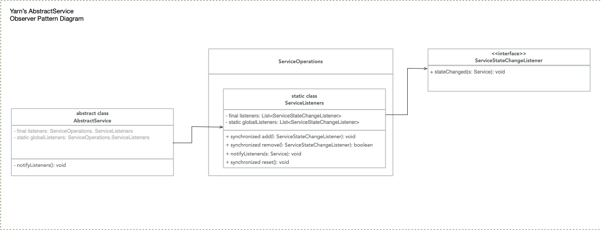

#### Observer Pattern 
* Relationship between publisher, subscriber and observer pattern:
> Publisher + Subscriber = Observer Pattern

* What's Observer Pattern in a nut shell?  
> Observer Pattern defines a one-to-many dependency between objects so that when one object changes it state, 
> all of it dependents are notified and updated automatically.

* Observer Pattern class diagram in UML


* What's loosely coupled? Any Cons? 
> When two objects are loosely coupled, then can interact, but have very little knowledge of each other. 
> Observer Pattern provides an object design where subjects and observers are loosely coupled. 

* Weather Station Design Pattern Diagram 
 

* Observer Pattern in hadoop's yarn structure is also deployed simple UML diagram shown below


* corresponding codes' segments in yarn's abstract service which organized listeners in observer pattern is shown below:
> AbstractServer, [code link](https://github.com/apache/hadoop/blob/bb8dda2bf95d7666b25cd0649e97c716c1352a45/hadoop-common-project/hadoop-common/src/main/java/org/apache/hadoop/service/AbstractService.java)
```java
// AbstractServer.java 
public abstract class AbstractService implements Service {
   private final ServiceOperations.ServiceListeners listeners = 
        new ServiceOperations.ServicesListeners();

   private static ServiceOperations.ServiceListeners globalListeners = 
        new ServiceOperations.ServiceListeners();
  
   // here we notify local && global listeners of state changes
   private void notifyListeners() {
       //   ...
        // passing current service to notifyListeners method
        listeners.notifyListeners(this);
        globalListeners.notifyListeners(this);
     //    ... 
   }
}
```

> ServiceOperations.java, [code link](https://github.com/apache/hadoop/blob/7b57f2f71fbaa5af4897309597cca70a95b04edd/hadoop-common-project/hadoop-common/src/main/java/org/apache/hadoop/service/ServiceOperations.java)
```java
public final class ServiceOperations {
    public static class ServiceListeners{
        private final List<ServiceStateChangeListener> listeners = new ArrayList<>();
        public synchronized void add(ServiceStateChangeListener l) {
            if (!listeners.contains(l)) {
                listeners.add(l);
            }
        }
       
        public synchronized boolean remove(ServiceStateChangeListener l) {
             return listeners.remove(l);
        }
        
        public synchronized void reset() {
            listeners.clear();
        }
 
        public void notifyListeners(Service service) {
            // copy current local listeners to tmp variant: callbacks 
            ServiceStateChangeListner [] callbacks;
            synchornized(this) {
                callbacks = listeners.toArray(new ServiceStateChangeListener[listeners.size()]);
            }
            // traverse each listener and call its stateChanged(s: Service) method 
            // to pass the new updated state to them
            // it is the same as the Observer Pattern's we iteraters each observer
            // which added to the observable by register method 
            for (ServiceStateChangeListener l : callbacks) {
                l.stateChanged(service);
            }
        }
    }
}
```
>> ServiceStateChangeListener.java [code link](https://github.com/apache/hadoop/blob/a55d6bba71c81c1c4e9d8cd11f55c78f10a548b0/hadoop-common-project/hadoop-common/src/main/java/org/apache/hadoop/service/ServiceStateChangeListener.java)
```java
// this interface can be treated the same as the Observer in which we define method udpate.
public interface ServiceStateChangeListener {
    void stateChanged(Service service);
}
```