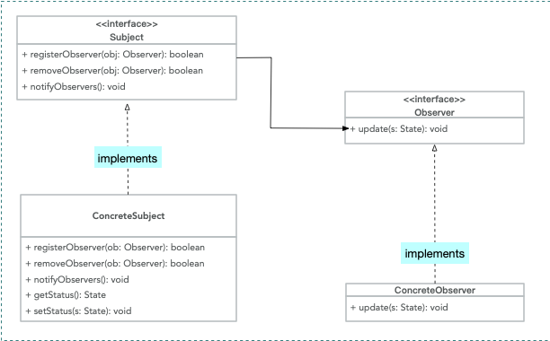
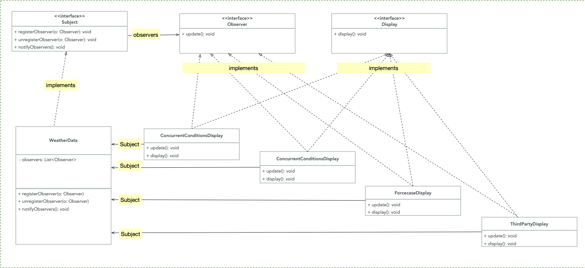

#### Observer Pattern 
* Relationship between publisher, subscriber and observer pattern:
> Publisher + Subscriber = Observer Pattern

* What's Observer Pattern in a nut shell?  
> Observer Pattern defines a one-to-many dependency between objects so that when one object changes it state, 
> all of it dependents are notified and updated automatically.

* Observer Pattern class diagram in UML

* What's loosely coupled? Any Cons? 
> When two objects are loosely coupled, then can interact, but have very little knowledge of each other. 
> Observer Pattern provides an object design where subjects and observers are loosely coupled. 

* Weather Station Design Pattern Diagram 
 